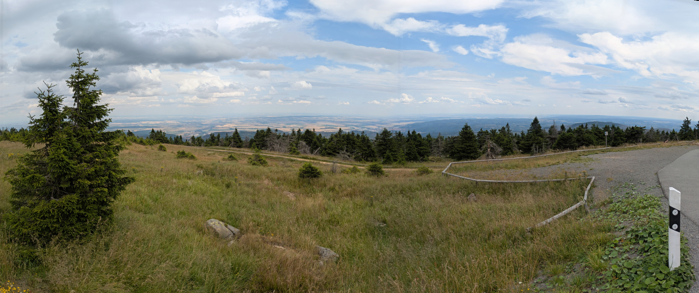

# Simple Panorama



A simple panorama stitcher application written in C++ with a GTK GUI. The app is written mostly from scratch with as little dependencies as possible. The stitching routine is based on the paper [Automatic Panoramic Image Stitching using Invariant Features](http://www2.ene.unb.br/mylene/PI/refs/ijcv2007.pdf).

---

## Table of Contents

- [How to Use](#how-to-use)
- [Examples](#examples)
- [How to Build](#how-to-build)
  - [Dependencies](#dependencies)
  - [Building on Ubuntu](#building-on-ubuntu)
  - [Cross-Compiling for Windows](#cross-compiling-for-windows)
- [Technical Details](#technical-details)
- [Recent Changes](#recent-changes)

---

## How to Use


1. Open the app and drag the images you wish to stitch from your folder into the drag field. Select your images and click on the "Panorama from selection" button.


2. You can crop the result by drawing a rectangle with the right mouse button on the preview screen. Note that the preview may look slightly different than the final result and saving large panoramas may take some time.

**Tips for Best Results:**
- Stay at the same point when taking pictures.
- Avoid taking multiple pictures without moving the camera.
- Use a standard lens camera (to minimize distortion).
- Parameters in the config menu can be tuned, but adjust them only if you are sure about their effects.

---

## Examples

All examples can be found in the `results` folder.


From the [PhotoFit gallery](http://www.photofit4panorama.com/gallery.html).


"Panorama" of a map.


The front door.


Little planet .

---

## How to Build

### Dependencies

You will need the following packages:
- [Eigen3](http://eigen.tuxfamily.org/) 
- [OpenCV](https://opencv.org/releases/)
- [GTK3](https://www.gtk.org/)

Additionally, you need a compiler that supports C++20 and CMake >= 3.1. To compile for Windows, you will also need [MXE](https://mxe.cc/).

### Building on Ubuntu

Install all dependencies with:

```bash
sudo apt-get install cmake gcc g++ libopencv-dev libeigen3-dev libgtk-3-dev
```

Clone the repository and build:

```bash
git clone https://github.com/shafiiganjeh/SimplePanorama
cd SimplePanorama
mkdir bin
cd bin
cmake ..
make -j$(nproc)
```

You can launch the app from inside the `bin` directory.

### Cross-Compiling for Windows

This process is slightly more complex. First, build MXE as [described here](https://mxe.cc/#tutorial).  
Then, from inside your MXE directory, run:

```bash
make eigen -j$(nproc)
make gtk3 -j$(nproc) MXE_TARGETS='x86_64-w64-mingw32.static'
make opencv -j$(nproc) MXE_TARGETS='x86_64-w64-mingw32.static'
```

Assuming you have built MXE in `~/mxe`, you can now cross-compile for Windows:

```bash
git clone https://github.com/shafiiganjeh/SimplePanorama
cd SimplePanorama
mkdir bin
cd bin
export PATH=~/mxe/usr/bin:$PATH
x86_64-w64-mingw32.static-cmake ..
make -j$(nproc)
x86_64-w64-mingw32.static-strip panorama.exe
```

Create the following folder structure inside `~/SimplePanorama`:

```
SimplePanorama/
  bin/
  share/
    glib-2.0/
      schemas/
```

Copy all files from `~/mxe/usr/x86_64-w64-mingw32.static/share/glib-2.0/schemas` into `~/SimplePanorama/share/glib-2.0/schemas`. Then, from the terminal:

```bash
cd ~/SimplePanorama/share/glib-2.0/schemas 
glib-compile-schemas .
```

After this, you can copy the SimplePanorama folder to your Windows machine and use it from inside the bin directory or via shortcut. There is no need to install anything.

---

## Technical Details

This section covers some technical details about this implementation.  
The app follows [Automatic Panoramic Image Stitching using Invariant Features](http://www2.ene.unb.br/mylene/PI/refs/ijcv2007.pdf) with several key changes:

### Changes in Bundle Adjustment

Bundle adjustment is performed differently. In Lowe's paper, the objective is to minimize residuals between real and projected point pairs. In this implementation, the objective is relaxed — residuals between estimated and projected point pairs are minimized instead. This change makes the algorithm more robust to outliers and results in fewer errors, but it is also slower than the original algorithm. You can still choose to use the original algorithm If you find the improved one too slow.

### Keypoint Retrieval Changes

SIFT has been replaced by [rootSIFT](https://www.robots.ox.ac.uk/~vgg/publications/2012/Arandjelovic12/arandjelovic12.pdf). Image matching is more elaborate and also includes keypoints in the overlap region of the images, instead of the entire image region.

### Blending Changes

Image seams are found via [Graphcut](https://dl.acm.org/doi/10.1145/882262.882264) instead of just using distance transform. This results in higher quality seams, but can be very slow, so it is disabled by default. You can enable this in the config menu.

## Recent Changes
* Added new Projection methods (Cylindrical,Stereographic).
* Added method for fixing missing centers-parts in Stereographic projections If possible.
* Added a new method for fixing exposure disparity.
* Added the option to use the original bundle adjustment Algorithm from "Automatic Panoramic Image Stitching using Invariant Features".
* Added the option whether to autoimatically straighten the panorama.
* Fixed some visual issues.
